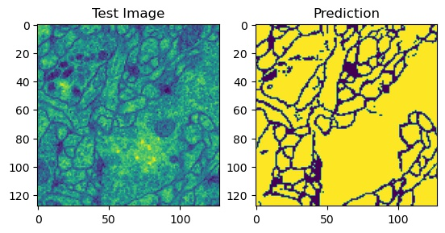

# UNet

The code presented here is a Tensorflow v2.2 implementation of the UNet model proposed in [Ronneberger et al. (2015)](Ronneberger2015.pdf). It can be used for image segmentation tasks.

## Features
1. The UNet model
2. Image augmentation
3. Training
4. Inference

## Dependencies
- Tensorflow v2.2
- imgaug
- numpy
- scipy
- skimage
- matplotlib

## Training
The model can be trained on arbitrary imaging data. The main parameters of the model, pipelining the images to the model, and the image augmentation can be easily modified in the train.py file.

## Inference
After the training, the model is saved as an h5 file to be used for inference within the inference.py file.

## Results
Here is an example prediction of the model on a test data:

The prediction is not perfect but acceptable. It can be improved with a better training of the model.

### Quick Start
Model Training:

    import os
    import unet
    import imgaug.augmenters as iaa
    from datetime import datetime
    from tensorflow.keras.callbacks import TensorBoard
    from utils import assign_paths

    # input data characteristics
    IMG_WIDTH = 128
    IMG_HEIGHT = 128
    OUTPUT_CHANNELS = 128

    # the paths to train and validation data
    train_im, train_seg, val_im, val_seg = assign_paths(train_im_folder, file_format='.png', split_no=5)
    
    # define an augmenter
    seq = iaa.Sequential([
        iaa.Fliplr(0.5),
        iaa.Flipud(0.5),
        iaa.ElasticTransformation(alpha=10, sigma=3)
    ])

    # plug in the input data characteristics, augmenter, and the data paths
    net = unet.UNet(IMG_WIDTH, IMG_HEIGHT, OUTPUT_CHANNELS)  # instantiate the UNet
    net.get_unet()  # load the model
    net.set_seq(seq)  # set the augmenter defined above
    net.process_train(train_im, train_seg)  # set train data pipeline
    net.process_val(val_im, val_seg)  # set validation data pipeline

    # fit the model
    net.fit(net.trainset.shuffle(5).batch(5).repeat(), epochs=1, validation_data=net.valset.batch(5))

    # save the model
    os.mkdir('saved_model')
    net.model.save('saved_model/unet_trained')

Running Inference:

    import unet
    from utils import plot_input_prediction

    # load the model and the weights
    net = unet.UNet()
    net.load_model('./trained_model/unet.h5')

    # define the test data path
    test_file = './data/test/train_1.png'

    # plug in the test data path, run inference, and create the resulting image
    net.load_testset(test_file)
    img = next(iter(net.testset.take(1)))
    res = net.model.predict(img.numpy().reshape(1, net.imwidth, net.imheight, 1))
